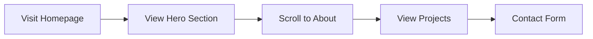

## 1. Product Overview
A modern personal portfolio website showcasing the user's skills, projects, and professional background. Designed to impress potential employers and clients with a visually striking and interactive experience.

## 2. Core Features

### 2.1 User Roles
| Role | Registration Method | Core Permissions |
|------|---------------------|------------------|
| Visitor | None | Browse portfolio content |

### 2.2 Feature Module
1. **Hero Section**: Animated introduction with name, title, and call-to-action
2. **About Section**: Personal bio and skills showcase
3. **Projects Section**: Portfolio projects with details and links
4. **Contact Section**: Contact form and social links

### 2.3 Page Details
| Page Name | Module Name | Feature description |
|-----------|-------------|---------------------|
| Home | Hero | Animated text, gradient backgrounds, scroll-triggered animations |
| Home | About | Skills progress bars, timeline, personal info |
| Home | Projects | Filterable project cards, hover effects, modal details |
| Home | Contact | Contact form with validation, social media links |

## 3. Core Process
Users land on the homepage and scroll through sections to learn about the portfolio owner. They can view project details, download resume, and send messages through the contact form.

## 4. User Interface Design
### 4.1 Design Style
- **Primary Color**: Deep navy blue (#1a1a2e)
- **Secondary Color**: Teal accent (#16c79a)
- **Button Style**: Rounded corners, gradient hover effects
- **Font**: Playfair Display (serif) for headings, Inter (sans-serif) for body
- **Layout**: Modern single-page scroll with smooth transitions
- **Icon Style**: Minimal line icons from Lucide

### 4.2 Page Design Overview
| Page Name | Module Name | UI Elements |
|-----------|-------------|-------------|
| Home | Hero | Animated gradient background, typewriter effect, floating elements |
| Home | About | Circular progress indicators, responsive grid layout |
| Home | Projects | Card-based layout with hover animations, filter tabs |
| Home | Contact | Glassmorphism form design, floating labels |

### 4.3 Responsiveness
Mobile-first approach with adaptive layouts for all screen sizes. Touch-friendly navigation with hamburger menu on mobile.

### 4.4 Animations
- Page load animations with staggered reveals
- Scroll-triggered fade-in effects
- Hover animations on interactive elements
- Smooth page transitions