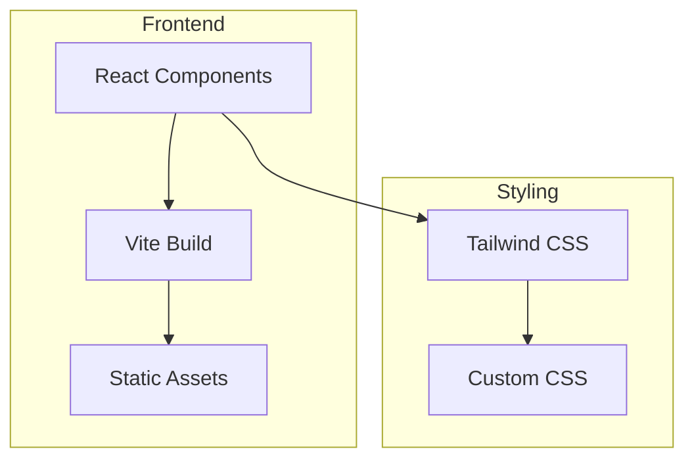

## 1. Architecture Design


## 2. Technology Description
- Frontend: React@18 + TypeScript + tailwindcss@3
- Build Tool: Vite@6
- Icons: lucide-react
- Animation: CSS animations + Framer Motion (optional)

## 3. Route Definitions
| Route | Purpose |
|-------|---------|
| / | Single-page portfolio with all sections |

## 4. Component Structure
```
src/
├── components/
│   ├── Hero.tsx          # Hero section with animation
│   ├── Navbar.tsx        # Navigation bar
│   ├── About.tsx         # About section with skills
│   ├── Projects.tsx      # Projects showcase
│   ├── Contact.tsx       # Contact form
│   └── Footer.tsx        # Footer section
├── data/
│   └── portfolio.ts      # Portfolio data (projects, skills)
├── App.tsx
├── main.tsx
└── index.css
```

## 5. Data Model
### 5.1 Portfolio Data Structure
```typescript
interface Project {
  id: number;
  title: string;
  description: string;
  tags: string[];
  image: string;
  link: string;
  github?: string;
}

interface Skill {
  name: string;
  level: number; // 0-100
  category: string;
}

interface ContactFormData {
  name: string;
  email: string;
  message: string;
}
```

## 6. Styling Guidelines
- Use Tailwind CSS for all styling
- Custom CSS variables for theme colors
- Responsive breakpoints: sm, md, lg, xl
- CSS animations for interactive elements

## 7. Performance Considerations
- Lazy loading for images
- Code splitting for better initial load
- Optimized asset sizes